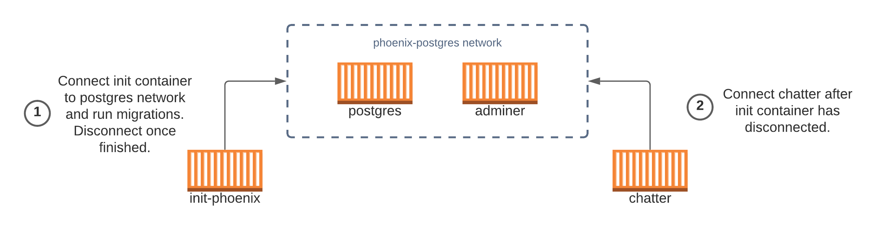
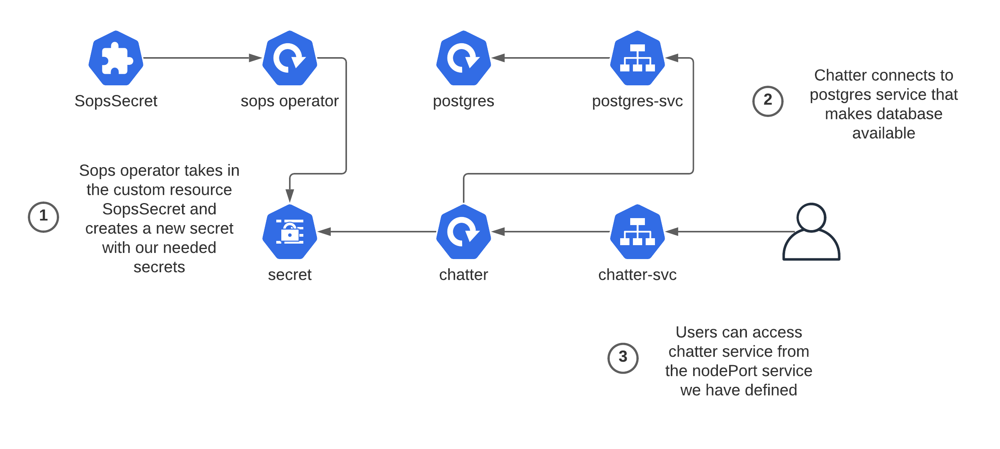
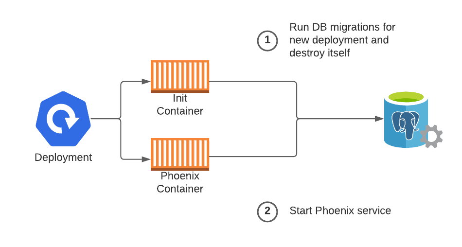

# Chatter
Example Phoenix demo leveraging the PETAL stack, docker, and kubernetes

## What is this?

As I have been learning elixir and the Phoenix Framework, I have found that the flow of development has been different than other languages and frameworks I have worked with in the past.  This isn't a bad thing, for elixir has some unique characteristics that make it a desirable language to work in.  This repository is an attempt to create a skeleton of what a Phoenix project could look like from testing to deployment.

The main application in this repository is a simple chat room app.  This is not a new idea.  It is based on [this awesome repository](https://github.com/dwyl/phoenix-chat-example) that walks you through a similar application. The main difference between their app and this one is that this is based on the [PETAL](https://thinkingelixir.com/petal-stack-in-elixir/) stack, an opinionated approach to Phoenix development that aims to replace SPA web apps.  With PETAL, a small group of developers can create a powerful and interactive client experience without needing a javascript/clientside framework specialist.

Although I think this repository does a good job at showcasing some of the simple yet powerful tasks one can accomplish with Phoenix and Elixir, I believe that the CI/CD that is leveraged will make your next Phoenix application that much easier to bring to production.  The tools that are used are pluggable, meaning you could replace them with your preferred tools, but I will say there is a lot of exciting development behind the chosen tools that will only make them better in the future.

## Prerequisites

This repository relies on these tools/software that will need to be installed prior to using:

- [Elixir](https://elixir-lang.org/install.html): We can't run an elixir application without elixir!
- [Phoenix Framework](https://hexdocs.pm/phoenix/installation.html): Again, Phoenix is the P in PETAL, so we're going to need it installed.  You can ignore the Postgres instruction, for we will be using docker.
- [Docker](https://docs.docker.com/get-docker/): Docker will be the backbone for our deployments.  It's an easy to use containerization platform that allows you to spin up and down linux containers on the major OSes.

If you only want to go as far as Docker, then you can stop here! If you would like to see how to deploy into kubernetes, you will need:

- [Kind](https://kind.sigs.k8s.io/docs/user/quick-start/): Kind allows us to run Kubernetes in Docker.  Although your produciton cluster should not run with Kind, it is a great tool for local development!
- [Kubectl](https://kubernetes.io/docs/tasks/tools/): Kubectl is how we will be communicating with our clusters
- [Helm](https://helm.sh/docs/intro/install/): Helm is how we will be packaging our kubernetes applications so they can be deployed into our cluster
- [Age](https://github.com/FiloSottile/age): Age is a simple, modern and secure file encryption tool that aims to tackle some of the downfalls of GPG.  We will be using it secure secrets in Kubernetes
- [Sops](https://github.com/mozilla/sops): Sops will leverage age to encrypt yaml files for Kubernetes

## Deploying With Docker

## Deploying on Kubernetes

